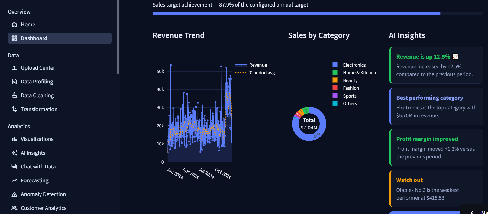
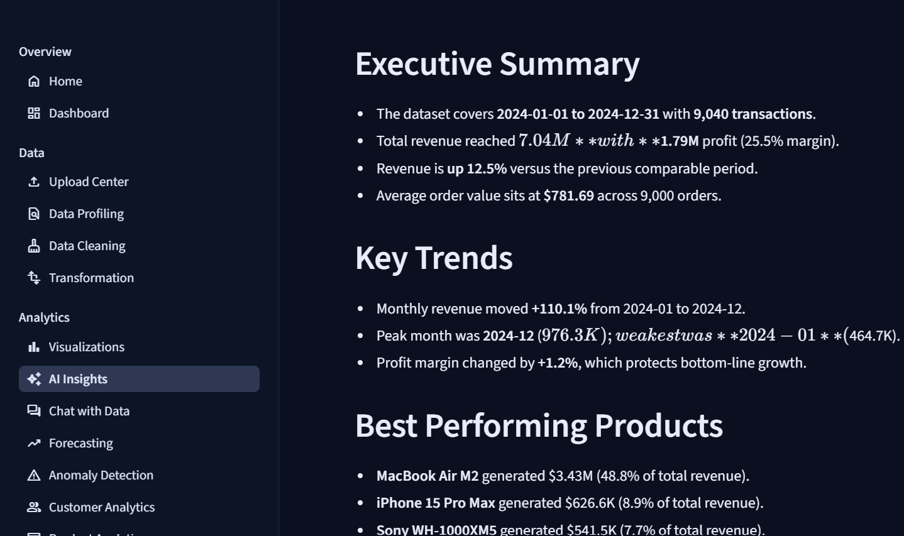
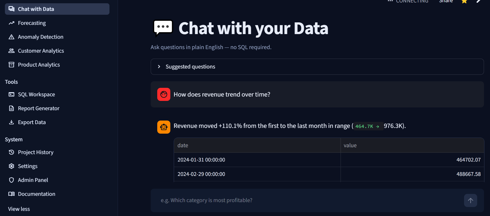
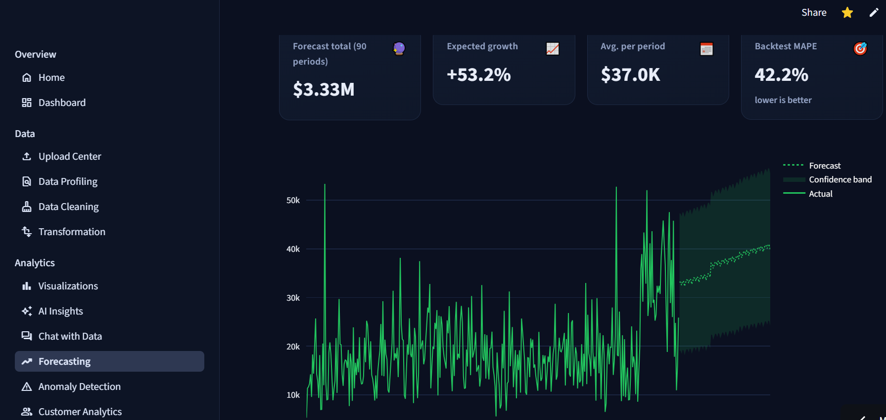
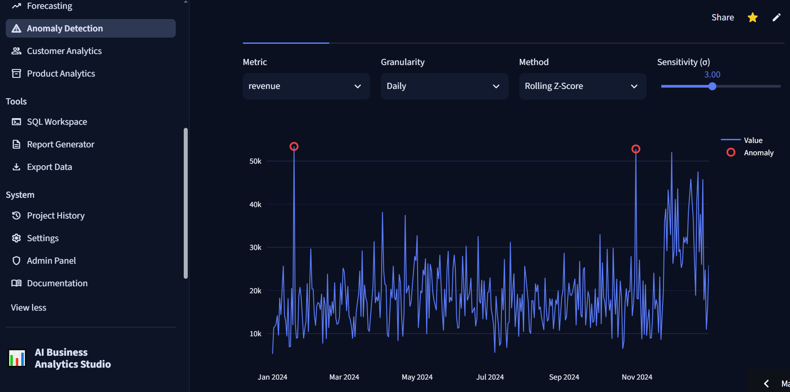

<div align="center">


# 📊 AI Business Analytics Studio

### Upload your business data. Get a dashboard, AI insights, forecasts and board-ready reports in minutes.

**A mini Power BI + ChatGPT for business data — built entirely in Python.**

[](https://www.python.org/)
[](https://streamlit.io/)
[](https://plotly.com/python/)
[](https://scikit-learn.org/)
[](https://aistudio.google.com/)
[](LICENSE)

</div>

---

## 🚀 Live Demo

**▶️ [Try the live app](https://your-app-name.streamlit.app)**

| | |
|---|---|
| **Demo login** | `demo` / `demo123` — or click **Continue as guest** |
| **No data?** | Hit **⚡ Load demo data** in the sidebar for a 9,040-row sales dataset |
| **No API key?** | Everything still works — the app falls back to a built-in offline analyst |

> ℹ️ Hosted on Streamlit Community Cloud. The filesystem there is ephemeral, so accounts and
> history reset when the app sleeps. Local and Docker installs persist normally.

---

## 📸 Screenshots

<div align="center">

### Business Dashboard


*Nine KPIs with period-over-period deltas, revenue trend, category breakdown, top products, regional map and an embedded 90-day forecast.*

### AI Insights & Chat
 

*Executive report on the left, natural-language Q&A on the right.*

### Forecasting & Anomaly Detection
 

*Confidence bands on projections; spikes and drops flagged with severity.*

</div>

---

## ✨ Features

<table>
<tr><th width="22%">Module</th><th>What it does</th></tr>

<tr><td>📤 <b>Upload Center</b></td><td>CSV, Excel (multi-sheet), JSON, ZIP archives, SQLite files and live SQL databases. Auto-detects encoding and delimiter, validates every file, shows upload progress.</td></tr>

<tr><td>🔍 <b>Data Profiling</b></td><td>Shape, dtypes, null counts and percentages, duplicates, memory usage, unique values, numeric statistics with skew and kurtosis, correlation matrix, and a 0–100 data-quality score.</td></tr>

<tr><td>🧹 <b>Smart Cleaning</b></td><td>Remove duplicates, 9 missing-value strategies, date standardisation, text case, whitespace trimming, outlier removal or clipping, type conversion, column renaming. Every action logged with one-click undo.</td></tr>

<tr><td>🔀 <b>Transformation</b></td><td>Group-by, pivot tables, dataset merges, column splitting, formula and ratio features, calendar features, binning, scaling, encoding, query filtering.</td></tr>

<tr><td>📊 <b>Dashboard</b></td><td>Revenue, Profit, Orders, Customers, Units, AOV, Margin, Revenue/Customer and Target Achievement — each with period-over-period change. Date, granularity and category filters.</td></tr>

<tr><td>📈 <b>Visualizations</b></td><td>14 chart types — bar, line, area, pie, donut, scatter, bubble, histogram, box, heatmap, treemap, sunburst, waterfall, correlation matrix — with filters, zoom, PNG and interactive-HTML export.</td></tr>

<tr><td>✨ <b>AI Insights</b></td><td>Executive summary, key trends, best and worst products, sales opportunities, business risks, customer insights and P1–P4 prioritised recommendations.</td></tr>

<tr><td>💬 <b>Chat with Data</b></td><td>"Why did sales drop?" · "Top 10 customers" · "Which category is most profitable?" — answered from your actual rows.</td></tr>

<tr><td>🔮 <b>Forecasting</b></td><td>Four models, 7–365 period horizons, backtested MAE/MAPE, 95% confidence bands and a what-if uplift slider.</td></tr>

<tr><td>🚨 <b>Anomaly Detection</b></td><td>Z-score, IQR, rolling z-score and Isolation Forest — over time series (spikes and drops with severity) and individual transactions.</td></tr>

<tr><td>👥 <b>Customer Analytics</b></td><td>RFM scoring, 11 named segments, 12-month CLV estimate, churn-risk bands, repeat-purchase rate, revenue concentration, cohort retention heatmap.</td></tr>

<tr><td>📦 <b>Product Analytics</b></td><td>Best sellers, slow movers, margins, revenue share, ABC classification, days-since-last-sale and heuristic inventory actions.</td></tr>

<tr><td>🖥️ <b>SQL Workspace</b></td><td>Every loaded dataset registered as a queryable table. Saved queries, CSV/Excel export, save results back as a dataset.</td></tr>

<tr><td>📄 <b>Report Generator</b></td><td>PDF, Excel, CSV bundle and PowerPoint — with KPI grid, charts, AI narrative and data tables.</td></tr>

<tr><td>🔐 <b>Auth & History</b></td><td>Registration, login, PBKDF2-SHA256 hashing with per-user salt, guest mode. Full history of datasets, reports, chats and activity.</td></tr>

<tr><td>⚙️ <b>Settings & Admin</b></td><td>Theme, language, Gemini key and model with a connection test, column-mapping editor, user and role management, usage analytics.</td></tr>
</table>

---

## 🏗 Architecture

```
┌──────────────────────────────────────────────────────────────────────────┐
│                        STREAMLIT UI  (app.py + views/)                   │
│  Home · Dashboard · Upload · Profiling · Cleaning · Transform · Charts    │
│  Insights · Chat · Forecast · Anomalies · Customers · Products · SQL      │
│  Reports · Exports · History · Settings · Admin · Docs      (20 pages)    │
└───────────────┬──────────────────────────────────────────────────────────┘
                │  session state: datasets · column mapping · chat · cache
┌───────────────▼──────────────────────────────────────────────────────────┐
│                          CORE ENGINE  (core/)                            │
│                                                                          │
│  loaders ──► mapping ──► cleaning ──► transform ──► kpis ──► charts       │
│                 │                                    │          │        │
│                 │  auto-detects date / revenue /     │          │        │
│                 │  profit / customer / product /     │          │        │
│                 │  category / region                 ▼          ▼        │
│  profiling   forecasting   customers   products   anomalies   insights    │
│               (sklearn)     (RFM/CLV)    (ABC)    (IsoForest)     │       │
│                                                                   ▼      │
│                                        nlq ◄──────────────► ai (Gemini)  │
│                                                                   │      │
│                                        reports ◄──────────────────┘      │
│                              (ReportLab · OpenPyXL · python-pptx)        │
└───────────────┬───────────────────────────────┬──────────────────────────┘
                │                               │
       ┌────────▼──────────────────┐  ┌─────────▼──────────┐
       │  SQLite / SQLAlchemy      │  │  Gemini API        │
       │  users · datasets ·       │  │  (optional —       │
       │  reports · chat · history │  │  offline fallback) │
       └───────────────────────────┘  └────────────────────┘
```

### The key design decision

**No column name is ever hard-coded.** `core/mapping.py` scores every column against regex patterns
**and** dtype checks to auto-detect *semantic roles* — `date`, `revenue`, `profit`, `customer_id`,
`product`, `category`, `region`, `quantity`, `cost`, `order_id` — which the user can override in one
screen. Every downstream module reads roles, never names.

That is why the same dashboard, RFM engine and forecaster run unchanged on a Shopify export, a
QuickBooks dump or a hand-typed spreadsheet. Two other rules follow from it:

* **`core/` holds logic and never imports Streamlit** (except the three session-aware modules), so
  every analytic is testable outside the UI.
* **Cleaning and transform functions return `(dataframe, message)`**, which is what makes the undo
  stack and the action log possible.

---

## 🛠 Tech Stack

| Layer | Technology | Why |
|---|---|---|
| **UI** | Streamlit 1.40+ | `st.navigation` multipage, custom CSS design system, no frontend build step |
| **Data** | Pandas, NumPy | Works on pandas 2 *and* 3 via `core/utils.py` dtype helpers |
| **Charts** | Plotly Express + Graph Objects | Interactive in-app, exportable to PNG for PDFs |
| **ML** | scikit-learn | Ridge, RandomForest, IsolationForest, StandardScaler family |
| **Database** | SQLAlchemy + SQLite | PostgreSQL/MySQL ready by changing one URI |
| **AI** | Google Gemini | `gemini-2.0-flash` by default, with a deterministic offline fallback |
| **Reports** | ReportLab, OpenPyXL, python-pptx, Kaleido | PDF, Excel, slides, chart rasterisation |
| **Auth** | hashlib PBKDF2-SHA256 | 120k iterations, per-user salt — no plaintext anywhere |
| **Deploy** | Docker + docker-compose, Streamlit Cloud | One command locally, one push to production |

---

## ⚙️ Installation

### Local

```bash
git clone https://github.com/<your-username>/ai-business-analytics-studio.git
cd ai-business-analytics-studio

python -m venv .venv
source .venv/bin/activate          # Windows: .venv\Scripts\activate

pip install -r requirements.txt
python scripts/generate_sample_data.py     # builds the demo dataset

streamlit run app.py
```

Open <http://localhost:8501> → sign in with **`demo` / `demo123`**.

### Enable AI (optional)

```bash
export GEMINI_API_KEY="your_key_from_https://aistudio.google.com/apikey"
```

Or paste the key into **Settings → AI model** at runtime. Without it the app runs in
**offline analyst mode** — every module still works.

### Docker

```bash
docker compose up --build          # → http://localhost:8501
```

### Deploy to Streamlit Cloud

1. Push the repo to GitHub.
2. [share.streamlit.io](https://share.streamlit.io) → **New app** → select the repo and `app.py`.
3. Add `GEMINI_API_KEY = "..."` under **Settings → Secrets**.
4. Deploy — every push to `main` redeploys automatically.

### Tests

```bash
PYTHONPATH=. python tests/smoke.py        # every analytics function end-to-end
PYTHONPATH=. python tests/test_views.py   # renders all 20 pages headlessly
```

---

## 📁 Dataset

The app works with **any** tabular business data. A realistic demo file ships with it:

**`data/samples/sales_2024.csv`** — 9,040 e-commerce orders across calendar year 2024.

| Column | Type | Description |
|---|---|---|
| `order_id` | text | Unique order reference |
| `order_date` | date | Order date, 2024-01-01 → 2024-12-31 |
| `customer_id` | text | 1,343 unique customers, Pareto-distributed activity |
| `customer_segment` | text | Consumer · Corporate · Small Business |
| `product` | text | 24 products |
| `category` | text | Electronics · Fashion · Home & Kitchen · Beauty · Sports · Others |
| `region` | text | 11 markets, mappable to the world map |
| `channel` | text | Online · Retail Store · Marketplace · Wholesale |
| `quantity` · `unit_price` · `discount` | numeric | Line-item detail |
| `cost` · `revenue` · `profit` | numeric | $7.04M revenue, 25.5% margin |

**It is deliberately messy** so every module has something to find: a growth trend with yearly
seasonality, Black Friday and Christmas peaks, a July dip, plus **40 duplicate rows**, **107 nulls**,
**12 revenue spikes** and trailing whitespace on ~3% of product names.

### Using your own data

Upload it, then check the **Column mapping** panel at the bottom of the Upload Center. Roles are
auto-detected from your headers and dtypes — confirm or correct them once and every module works.
Minimum for the dashboard: a **date** and a **revenue** column.

---

## 🤖 AI Features

### 1. Business Insights Report

The app builds a compact **data brief** — KPIs, monthly revenue, top categories, regions, products,
category margins, weakest products — and asks Gemini for eight fixed sections:

`Executive Summary` · `Key Trends` · `Best Performing Products` · `Underperforming Products` ·
`Sales Opportunities` · `Business Risks` · `Customer Insights` · `Actionable Recommendations`

The prompt forbids invented figures and requires prioritised (P1–P4) imperative recommendations.

### 2. Natural Language Chat

```
Question ──► Gemini writes ONE pandas expression
         ──► expression screened against a forbidden-pattern regex
         ──► evaluated with no builtins, only {df, pd, np} in scope
         ──► result + KPIs sent back to Gemini for a plain-English narrative
```

Blocked outright: imports, dunders, `open`, `exec`/`eval`, `os`/`sys`/`subprocess`, file writes and
attribute hacks. The model can read your dataframe; it cannot touch your machine.

### 3. Offline analyst — the fallback that makes AI optional

Without an API key, a deterministic rule engine takes over. It writes the same eight report sections
from computed statistics and answers chat through intent matching (top/worst products, customers,
regions, margins, trends, "why did sales drop"). **No feature is ever a dead end**, and no raw rows
leave the machine.

### 4. Privacy

Only small aggregated summaries — never raw rows — are sent to Gemini, and only when a key is
configured. Files stay in the session and the local SQLite database.

---

## 📄 Report Generator

Four formats, assembled from whichever sections you tick.

| Format | Library | Contents |
|---|---|---|
| **PDF** | ReportLab | Title block, 4-column KPI grid with deltas, embedded charts, AI narrative rendered from markdown, data tables, page footers |
| **Excel** | OpenPyXL | KPI sheet plus one sheet per table, styled headers, frozen panes, auto-fitted columns |
| **CSV bundle** | zipfile | Full dataset + every table as CSV, insights as `.md` |
| **PowerPoint** | python-pptx | Title slide, KPI slide, one slide per insight section |

**Selectable sections:** KPI summary · AI insights · Charts · Product performance ·
Category performance · Top customers · Raw data sample.

Every generated report is saved to `data/reports/` and listed in **Project History** for re-download.

> Chart images in PDFs need `kaleido`. If it is unavailable the PDF still builds — text and tables
> only — rather than failing.

---

## 🧗 Challenges & Solutions

| # | Challenge | Solution |
|---|---|---|
| **1** | **Every business names columns differently** — `Sales`, `revenue`, `Total_Amount`, `Order Value`. Hard-coding names would limit the app to one dataset. | Built a semantic-role layer that scores columns on regex **and** dtype, with a fallback that picks the largest-magnitude numeric column as revenue. Users override in one screen. |
| **2** | **Role collisions.** `customer_segment` matched the `category` pattern because it contains "segment", stealing the role from the real `category` column. | Replaced first-match-wins with **scoring**: exact name match beats prefix beats suffix beats contains, minus a penalty when a name also matches another role. |
| **3** | **pandas 3 broke dtype checks.** Strings stopped being `object`, so `df[c].dtype == object` silently returned zero text columns — cleaning tools appeared empty. | Added `core/utils.py` with `is_text()` / `text_columns()` that work on pandas 2 and 3, and routed every check through it. |
| **4** | **A merge crashed a whole page in production.** Joining a text key to a numeric one raised `ValueError` and took down the Transform page. | The merge now reconciles keys — parses both as numbers when they look numeric, else compares as trimmed strings — and warns when zero rows match. Every transform and cleaning action is wrapped so a failure is a red message, not a crash. |
| **5** | **KPI totals halved** when period-over-period comparison was on, because the "current" value had been reassigned to the second half of the range. | Deltas are now computed from the two halves while the displayed value stays the full-range total. |
| **6** | **AI as a single point of failure.** No key, no quota or no network meant no insights and no chat. | Wrote a full deterministic analyst that mirrors the AI's output structure. The app is genuinely useful with zero API access. |
| **7** | **LLM-generated code is an obvious attack surface.** | Sandboxed evaluation: forbidden-pattern regex, single-line only, no builtins, only `{df, pd, np}` in scope. |
| **8** | **Optional heavy dependencies** (`kaleido`, `python-pptx`) fail to install on some hosts. | Import-guarded with graceful degradation — the PDF drops images instead of erroring; PowerPoint shows an install hint. |

---

## 📈 Improvements Made

* **Testable core.** Business logic lives in `core/` and never imports Streamlit, so `tests/smoke.py`
  exercises every analytic without a browser — and `tests/test_views.py` renders all 20 pages
  headlessly to catch layout errors before deploy.
* **Undo everywhere.** Cleaning steps snapshot the frame and return a message, giving a full action
  log plus one-click undo instead of forcing a re-upload after a mistake.
* **Fail-soft as a policy.** Unmapped roles produce a helpful hint ("map a customer column to unlock
  RFM"), never a stack trace. Missing libraries degrade instead of crashing.
* **Cheap AI calls.** Only an aggregated brief goes to the model — token cost stays flat whether the
  dataset has 1,000 rows or 1,000,000.
* **Backtested forecasts.** An 80/20 time split reports MAE and MAPE, so users see how much to trust
  a projection rather than a bare line.
* **One design system.** All colours, cards and Plotly theming live in `core/theme.py`, so the app
  looks consistent across 20 pages and a new page inherits the styling for free.

---

## 🗺 Roadmap

- [ ] Prophet and SARIMAX forecasting with automatic model selection
- [ ] Scheduled refreshes and email delivery of reports
- [ ] Alerting rules — notify when an anomaly or KPI threshold fires
- [ ] Live connectors for Shopify, Stripe, Google Sheets and QuickBooks
- [ ] PostgreSQL backend for persistent multi-user deployments
- [ ] Multi-tenant workspaces with row-level permissions
- [ ] Vector-store memory so chat remembers findings across sessions
- [ ] Model-agnostic AI layer (OpenAI, Claude, local Ollama)
- [ ] Urdu interface translation
- [ ] CI pipeline running the test suite on every push

---

## ⚠️ Disclaimer

Forecasts, anomaly flags and AI commentary are decision *support*, not decision *guarantees*.
Statistical outliers are not proof of fraud, and no model can anticipate a campaign, a price change
or a market shock. Validate against your own domain knowledge before acting.

---

## 📜 License

Distributed under the **MIT License**. See [`LICENSE`](LICENSE) for details.

<div align="center">

⭐ **Star this repo if you found it useful.**

</div>
